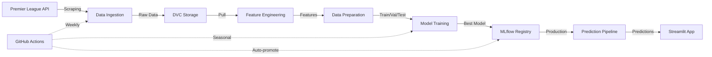

# 🏆 Premier League Final Standings Prediction - MLOps Project

[](https://github.com/7a99ui/premier_league_mlops/actions)
[](https://www.python.org/downloads/)
[](https://dagshub.com/7a99ui/premier_league_mlops)
[](https://dvc.org/)

Système MLOps complet pour prédire le classement final de la Premier League avec **CI/CD automatisé**, **réentraînement saisonnier**, et **prédictions hebdomadaires**.

---

## 📋 Table des matières

- [Vue d'ensemble](#-vue-densemble)
- [Architecture](#️-architecture)
- [Fonctionnalités](#-fonctionnalités)
- [Installation](#-installation)
- [Utilisation](#-utilisation)
- [CI/CD Workflows](#-cicd-workflows)
- [Déploiement](#-déploiement)
- [Structure du projet](#-structure-du-projet)
- [Technologies](#-technologies)
- [Résultats](#-résultats)

---

## 🎯 Vue d'ensemble

Ce projet implémente un pipeline MLOps end-to-end pour prédire le classement final de la Premier League en utilisant :

- **Données historiques** : 2015-2016 à 2025-2026
- **Modèle** : Ensemble Stacking (Ridge + Lasso + LightGBM)
- **Performance** : MAE ~4.78 points, R² ~0.90
- **Automatisation** : Workflows GitHub Actions pour scraping, training, et prédictions
- **Versioning** : DVC pour les données, MLflow pour les modèles

### 🎬 Démo


---

## 🏗️ Architecture



### Composants principaux

| Composant | Technologie | Rôle |
|-----------|-------------|------|
| **Data Ingestion** | Python + Requests | Scraping API Premier League |
| **Data Validation** | Great Expectations | Validation qualité données |
| **Feature Engineering** | Pandas + NumPy | Création features ML |
| **Model Training** | Scikit-learn + LightGBM | Entraînement modèles |
| **Experiment Tracking** | MLflow | Tracking expériences |
| **Data Versioning** | DVC + DagsHub S3 | Versioning données |
| **CI/CD** | GitHub Actions | Automatisation pipelines |
| **Frontend** | Streamlit | Interface utilisateur |
| **Containerization** | Docker | Déploiement |

---

## ✨ Fonctionnalités

### 🤖 Automatisation complète

- ✅ **Scraping hebdomadaire** : Récupération automatique des nouveaux matchs chaque lundi
- ✅ **Prédictions automatiques** : Génération des prédictions après chaque gameweek
- ✅ **Réentraînement annuel** : Entraînement automatique en fin de saison
- ✅ **Auto-promotion** : Promotion automatique du meilleur modèle en production
- ✅ **Validation continue** : Validation automatique des données et features

### 📊 Gestion des données

- ✅ **Versioning DVC** : Toutes les données sont versionnées et traçables
- ✅ **Split temporel** : Train/Val/Test respectant l'ordre chronologique
- ✅ **Détection intelligente** : Skip automatique des saisons déjà téléchargées
- ✅ **Validation Great Expectations** : Checks automatiques de qualité

### 🎯 Modélisation avancée

- ✅ **Ensemble Methods** : Stacking et Voting de multiples modèles
- ✅ **Hyperparameter Tuning** : Optimisation automatique avec RandomizedSearchCV
- ✅ **Feature Engineering** : 49 features calculées (form, momentum, strength of schedule)
- ✅ **Model Registry** : Gestion des versions avec MLflow

---

## 🚀 Installation

### Prérequis

- Python 3.11+
- Git
- Docker (optionnel)
- Compte DagsHub (pour MLflow et DVC)

### Installation locale

```bash
# 1. Cloner le repository
git clone https://github.com/7a99ui/premier_league_mlops.git
cd premier_league_mlops

# 2. Créer l'environnement virtuel
python -m venv venv
source venv/bin/activate  # Windows: venv\Scripts\activate

# 3. Installer les dépendances
pip install -r requirements.txt

# 4. Configurer les variables d'environnement
cp .env.template .env
# Éditer .env avec vos credentials DagsHub

# 5. Configurer DVC
dvc remote modify origin --local access_key_id YOUR_DAGSHUB_TOKEN
dvc remote modify origin --local secret_access_key YOUR_DAGSHUB_TOKEN

# 6. Récupérer les données
dvc pull
```

### Installation Docker

```bash
# Build et lancer les containers
docker compose up --build

# Accéder à l'application
# Frontend: http://localhost:8501
# Backend: http://localhost:8000
```

---

## 💻 Utilisation

### Mode Local

#### 1. Scraping des données

```bash
# Scraping historique (toutes les saisons)
python src/data/ingestion.py --mode historical

# Scraping incrémental (nouvelle saison)
python src/data/ingestion.py --mode incremental --season 2025-2026
```

#### 2. Feature Engineering

```bash
# Générer les features pour toutes les saisons
python src/data/features.py \
  --seasons 2015-2016 2016-2017 ... 2025-2026 \
  --raw-data-dir data/raw \
  --output-dir data/processed
```

#### 3. Préparation des données

```bash
# Split train/val/test + scaling
python src/data/prepare.py \
  --features-path data/processed/features.parquet \
  --output-dir data/processed
```

#### 4. Entraînement

```bash
# Entraînement complet avec auto-promotion
python src/models/train.py \
  --phase all \
  --data-dir data/processed \
  --auto-promote
```

#### 5. Prédictions

```bash
# Prédire le classement final
python src/models/predict.py \
  --season 2025-2026 \
  --gameweek 16 \
  --mlflow-stage Production

# Prédire l'évolution sur plusieurs gameweeks
python src/models/predict.py \
  --season 2025-2026 \
  --gameweek 16 \
  --evolution \
  --mlflow-stage Production
```

#### 6. Lancer l'interface Streamlit

```bash
streamlit run frontend/app.py
```

---

## 🔄 CI/CD Workflows

### 📅 Weekly Prediction Pipeline

**Déclenchement** : Chaque lundi à 9h UTC + Manuel

**Étapes** :
1. Scraping des nouveaux matchs (mode incrémental)
2. Validation des données brutes
3. Génération des features (toutes saisons)
4. Validation des features
5. Préparation des données (mise à jour test.parquet)
6. Génération des prédictions (classement final + évolution)
7. Commit et push vers DVC
8. Push vers GitHub

**Fichier** : `.github/workflows/weekly-prediction.yml`

### 🏆 Seasonal Retraining Pipeline

**Déclenchement** : 1er juin à 00h UTC (fin de saison) + Manuel

**Étapes** :
1. Scraping historique complet (skip saisons existantes)
2. Validation des données brutes
3. Génération des features (toutes saisons)
4. Validation des features
5. Préparation des données (split temporel)
6. Entraînement de tous les modèles :
   - Baseline (Ridge, Lasso, ElasticNet)
   - Fine-tuning (RandomForest, GradientBoosting, LightGBM)
   - Ensemble (Stacking, Voting)
7. Sélection du meilleur modèle
8. **Comparaison avec Production**
9. **Auto-promotion si meilleur** (basé sur MAE)
10. Commit et push vers DVC
11. Push vers GitHub

**Fichier** : `.github/workflows/seasonal-retraining.yml`

### 🔑 Secrets GitHub requis

```yaml
DAGSHUB_TOKEN: "your_dagshub_token"
DAGSHUB_USERNAME: "your_username"
MLFLOW_TRACKING_URI: "https://dagshub.com/USER/REPO.mlflow"
```

---

## 🐳 Déploiement

### Docker Compose (Local)

```bash
# Lancer les services
docker compose up -d

# Voir les logs
docker compose logs -f frontend

# Redémarrer après mise à jour
docker compose restart frontend

# Arrêter les services
docker compose down
```

### Streamlit Cloud (Production)

1. Connectez-vous sur [share.streamlit.io](https://share.streamlit.io)
2. Déployez depuis votre repo GitHub
3. Configurez les secrets :
   ```
   MLFLOW_TRACKING_USERNAME = "7a99ui"
   MLFLOW_TRACKING_PASSWORD = "your_token"
   ```
4. L'app se redéploie automatiquement à chaque push

### Railway / Render

Similaire à Streamlit Cloud, avec support Docker natif.

---

## 📁 Structure du projet

```
premier_league_mlops/
├── .github/
│   └── workflows/
│       ├── weekly-prediction.yml      # Pipeline hebdomadaire
│       └── seasonal-retraining.yml    # Pipeline saisonnier
├── backend/
│   ├── app.py                         # API FastAPI
│   └── Dockerfile
├── frontend/
│   ├── app.py                         # Interface Streamlit
│   ├── requirements.txt
│   └── Dockerfile
├── src/
│   ├── data/
│   │   ├── ingestion.py              # Scraping API
│   │   ├── validation.py             # Great Expectations
│   │   ├── features.py               # Feature engineering
│   │   └── prepare.py                # Data preparation
│   └── models/
│       ├── train.py                  # Training pipeline
│       ├── predict.py                # Prediction pipeline
│       └── promote_model.py          # Model promotion
├── data/
│   ├── raw/                          # Données brutes (DVC)
│   ├── processed/                    # Features (DVC)
│   └── validation_reports/           # Rapports validation
├── models/
│   └── production/                   # Modèles locaux
├── configs/
│   ├── mlflow_config.yaml           # Config MLflow
│   └── training_config.yaml         # Config training
├── scripts/
│   └── cleanup_models.py            # Nettoyage MLflow
├── notebooks/                        # Notebooks exploration
├── .dvc/                            # Configuration DVC
├── .env.template                    # Template variables env
├── requirements.txt                 # Dépendances Python
├── docker-compose.yml              # Orchestration Docker
└── README.md
```

---

## �️ Technologies

### Data & ML
- **Python 3.11** : Langage principal
- **Pandas** : Manipulation de données
- **Scikit-learn** : Modèles ML (Ridge, Lasso, RandomForest, GradientBoosting)
- **LightGBM** : Gradient boosting optimisé
- **NumPy** : Calculs numériques

### MLOps
- **MLflow** : Experiment tracking + Model registry
- **DVC** : Data versioning
- **Great Expectations** : Data validation
- **DagsHub** : Remote storage (S3) + MLflow hosting

### DevOps
- **GitHub Actions** : CI/CD
- **Docker** : Containerization
- **Docker Compose** : Orchestration multi-containers

### Frontend
- **Streamlit** : Interface web interactive
- **Plotly** : Visualisations (optionnel)

---

## 📊 Résultats

### Performance du modèle

| Métrique | Validation | Test |
|----------|------------|------|
| **MAE** | 4.78 points | 5.55 points |
| **RMSE** | 6.27 points | 7.01 points |
| **R²** | 0.8988 | 0.8501 |

### Amélioration vs Production

- **Ancien modèle (v2)** : MAE 5.03
- **Nouveau modèle (v11)** : MAE 4.78
- **Gain** : +5.14% de précision

### Modèles comparés

| Modèle | Val MAE | Rang |
|--------|---------|------|
| **Ensemble Stacking** | **4.78** | 🥇 |
| Ensemble Voting | 4.79 | 🥈 |
| Fine-tuned Lasso | 4.85 | 🥉 |
| Baseline Ridge | 4.94 | 4 |
| Fine-tuned Ridge | 4.94 | 4 |

---

## 🤝 Contribution

Les contributions sont les bienvenues !

1. Fork le projet
2. Créer une branche (`git checkout -b feature/amazing-feature`)
3. Commit les changements (`git commit -m 'Add amazing feature'`)
4. Push vers la branche (`git push origin feature/amazing-feature`)
5. Ouvrir une Pull Request

---

## 📝 License

MIT License - voir [LICENSE](LICENSE) pour plus de détails.

---

## 👥 Auteur

**Akram Haggui**
- GitHub: [@7a99ui](https://github.com/7a99ui)
- DagsHub: [premier_league_mlops](https://dagshub.com/7a99ui/premier_league_mlops)

---

## 🙏 Remerciements

- [Premier League](https://www.premierleague.com/) pour l'API
- [DagsHub](https://dagshub.com/) pour l'hébergement MLflow et DVC
- [Streamlit](https://streamlit.io/) pour le framework frontend

---

## 📚 Documentation supplémentaire

- [Guide d'installation détaillé](docs/installation.md)
- [Architecture technique](docs/architecture.md)
- [Guide de contribution](docs/contributing.md)
- [FAQ](docs/faq.md)

---

**⭐ Si ce projet vous est utile, n'hésitez pas à lui donner une étoile !**